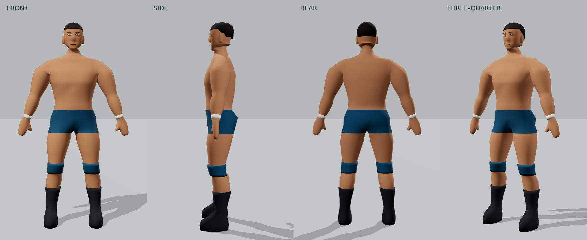
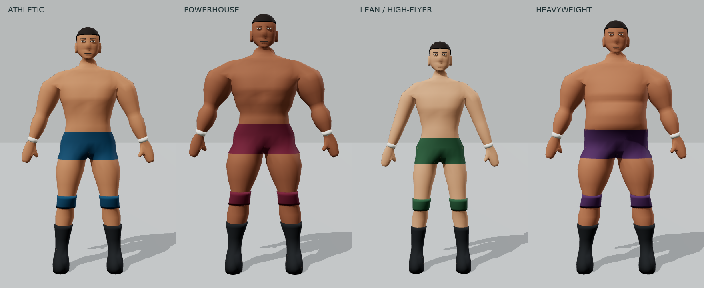

# Procedural human model lab

Open `/model-lab`, or use **Model lab** in the ring view. The match renderer and controls are unchanged. The lab is an isolated presentation experiment, not a new match simulation.

## Generation pipeline

`definition.ts` → `generateHuman(body)` → indexed `BufferGeometry` → `HumanPreview.tsx`.

- `src/game/scene/human/definition.ts` owns the visual definition, bounded numeric controls and four presets.
- `generateHuman.ts` authors anatomical cross-sections in metres. The torso has separate chest/abdomen and back profiles. Shoulder openings share vertices with the arms; the pelvis branches into both thighs around one shared crotch vertex. Palms branch into thumbs. Neck and skull loops are stitched together, including loops of different resolutions.
- `head.ts` authors jaw, chin, cheeks, eye sockets, forehead, cranium and nose through profiles. Ears are small fitted shells. Eye whites, pupils, brows and mouth are colored geometry. The short crop uses skull profiles, not an independent sphere.
- `mesh.ts` owns indexed loops, caps, unequal-loop stitching, connected-shell winding and normals. Unreferenced construction vertices are removed. There is no imported mesh, texture, image or character asset.
- `src/model-lab` owns only React controls, studio lighting, camera and R3F presentation. No match engine, Zustand or physics rules are added to the generator.

The head, torso, arms, palms, thumbs and legs form one closed connected surface. Ears and bare feet are additional fitted closed shells in the same skin geometry. This is not yet a fully welded, rigged production character.

## Parameters and presets

Height is in metres. Other dimensions are bounded ratios around the authored adult; muscle and softness range from 0 to 1. The completed skin is grounded and normalized to the requested height, so changing torso, head or leg proportions does not silently change stature. Hair extends slightly above measured skin height.

| Group      | Controls                                                           |
| ---------- | ------------------------------------------------------------------ |
| Frame      | Height, shoulders, chest width/depth, waist, pelvis, torso length  |
| Arms       | Length, upper-arm mass, forearm mass, hand size                    |
| Legs       | Length, thigh mass, calf mass, foot size                           |
| Head/build | Head size, neck thickness/length, muscle definition, body softness |
| Appearance | Skin, gear, tape and hair colors; crop/no hair; gear visibility    |

Athletic is the baseline. Powerhouse increases shoulder/chest, neck and limb mass. Lean / high-flyer reduces mass and slightly lengthens the legs. Heavyweight adds anterior abdominal volume, a wider waist/pelvis and softer definition, independently of stature. These are parameter sets, not global X/Y scaling.

To add a preset, add a named `preset({...bodyOverrides}, skinColor, gearColor)` entry in `bodyPresets`. The lab automatically exposes it. Run unit tests and inspect front, both sides, rear and three-quarter with gear off as well as on. Numeric validation clamps finite values and rejects NaN/Infinity; it is not a substitute for reviewing newly combined proportions.

## Anatomical and gear rules

Use continuous profiles to move mass; do not attach a sphere to represent a muscle. Keep a distinct rib cage, waist, pelvis, elbow, wrist, knee and ankle. Chest definition must not be mirrored onto the back. Hand silhouettes include a joined thumb, palm and grouped fingers. Boots have heel, instep and forefoot profiles.

Trunks reuse the body's indexed pelvis/thigh faces with a small normal offset. Pads sample the underlying leg profile; boot shafts follow the leg's stance. Future clothing should consume these surfaces/profiles or their anatomical landmarks rather than guess attachment positions in JSX. New hair belongs beside `buildHead` and should follow the generated skull. Neither system belongs in the match engine.

The model uses seven material groups/meshes and 5,098 triangles including all gear and hair. Geometry is memoized by body parameters and disposed on replacement/unmount; changing colors does not regenerate it. This budget is suitable for further match-scene investigation, but is not an on-device frame-rate guarantee. No rig, skinning, LODs or animation were added.

## Visual review and limitations

Refinement passes corrected angular shoulders, a slab-like face, disconnected neck geometry, an over-pinched pelvis, chest contours accidentally appearing on the back, calf/boot and knee-pad clipping, and garment surface fighting. The final hand pass replaces the separate thumb piece with a true palm branch. Camera buttons occupy their own strip so they do not cover the feet.

The four presets were reviewed in front, side, rear and three-quarter views. Browser layouts were checked at desktop, 915×412 landscape phone, 900×868 unfolded foldable and 1024×768 tablet sizes. Narrow portrait phones retain the existing rotate-device gate. Dragging/touch orbit and pinch/scroll zoom use Drei OrbitControls; preset camera buttons restore consistent framing and stop automatic rotation.

Remaining limitations: the face is deliberately minimal and currently shared between builds, finger masses are mitten-like, the crop is a single simple style, and extreme combinations still need art direction. Ears/feet need welding and deformation review before skinning. The mesh should not be treated as animation-ready merely because its static silhouette works. Trunks currently have a short-legged cut rather than a custom-cut costume system.

## Verification

Run the six commands required in `AGENTS.md`. Unit tests cover deterministic generation, finite data, valid indices, geometry budget, height/ground normalization, closed body edges, normalized normals and each parameter's endpoints. Browser tests verify actual mesh rendering, presets, sliders, view selection, toggles, reset, ring navigation and portrait recovery on all three existing projects. Existing tests remain intact.

A local Chromium binary can optionally be supplied with `PLAYWRIGHT_CHROMIUM_EXECUTABLE`; normal CI still uses Playwright's installed Chromium. Software WebGL is enabled for browser verification. Screenshots in `docs/model-lab/` are actual WebGL captures, not concept art.

## Captured views

[Uncovered anatomy](model-lab/anatomy.png) · [Landscape phone](model-lab/phone.png) · [Foldable](model-lab/foldable.png) · [Tablet](model-lab/tablet.png)
