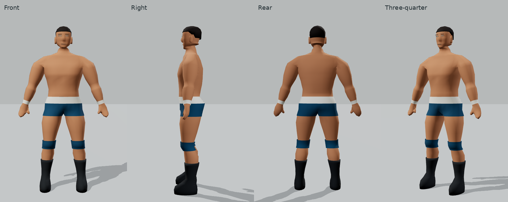
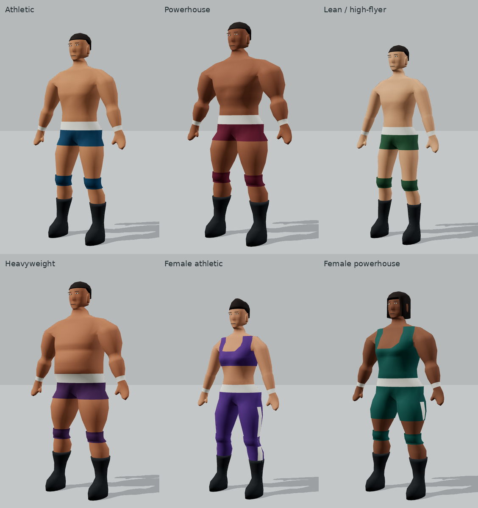
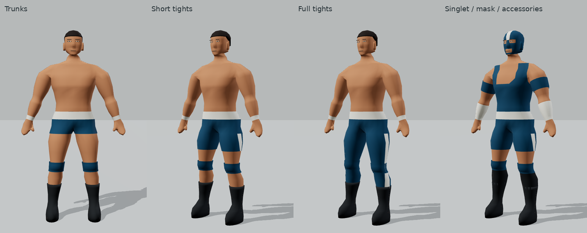
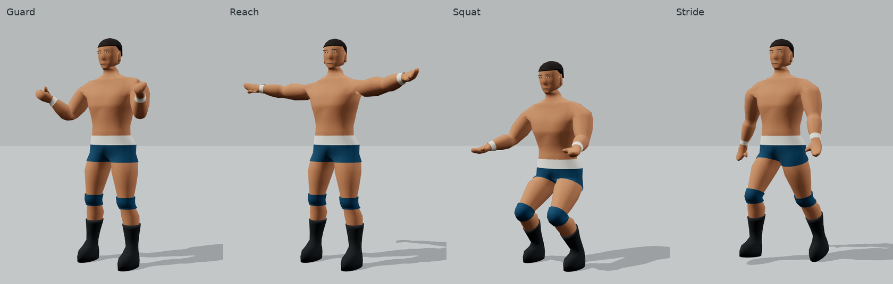

# Procedural Create a Wrestler

Open `/create-wrestler` or use **Create a wrestler** in the ring view. `/model-lab` remains an alias. This is an isolated character creator: the match renderer, simulation, physics and controls are unchanged. No character assets or new dependencies are used.

## Actual pipeline

`WrestlerVisualDefinition` → anatomical surfaces → proportion-aware bind skeleton + weights → fitted wardrobe → R3F skinned meshes.

| File under `src/game/scene/human/` | Responsibility                                                                                                          |
| ---------------------------------- | ----------------------------------------------------------------------------------------------------------------------- |
| `definition.ts`                    | Bounded body parameters, six presets, face/hair choices and independent wardrobe slots                                  |
| `generateHuman.ts`                 | Continuous torso, branching shoulders/arms/palms/thumbs and pelvis/legs; height normalization; heel/instep/toe profiles |
| `mesh.ts`                          | Indexed profile joining, unequal boundary stitching, consistent winding, normals and anatomical region ownership        |
| `head.ts`                          | Authored skull/jaw/nose profiles, minimal geometry features and skull-following hairstyles                              |
| `rig.ts`                           | 25-bone hierarchy, bind positions, region-aware normalized skin weights                                                 |
| `poses.ts`                         | Deterministic presentation-only pose studies and time-based joint motion                                                |
| `wardrobe.ts`                      | Body-derived panels, clipped garment boundaries, interpolated skin weights and material batching                        |

`src/model-lab/HumanPreview.tsx` manages generated resources and binds every visible part to one skeleton. `CustomizationControls.tsx` and `CreatorFields.tsx` own body, face and attire controls. `StudyControls.tsx` owns preview poses and collapsed advanced inspection. Generator code does not depend on React or the match engine.

## Anatomy and customization

Height is in metres. Lengths, widths and masses are bounded ratios around an authored adult. The skin is grounded and normalized to requested height; hair can extend above it. Controls cover shoulders, chest width/depth, waist, pelvis, torso, arm/leg length, upper-arm/forearm/thigh/calf mass, hands, feet, head, neck thickness/length, muscle and softness. Female morphology blends pelvic flare, waist contour and integrated chest shape; chest contour has a separate control. These controls are independent of face, hair and gear.

Presets: **Athletic**, **Powerhouse**, **Lean / high-flyer**, **Heavyweight**, **Female athletic**, **Female powerhouse**. Female builds have their own frame/mass distributions. Choosing a build preserves the current outfit and enables the athletic top for female builds. They use the same connected body topology and rig. Add another `bodyPresets` entry using `preset({...}, skin, gear)` and override `face`, `hairstyle` or `wardrobe` as needed. Numeric validation clamps finite inputs and rejects NaN/Infinity. Review combined proportions visually; validation is not art direction.

Muscle and softness change the continuous surface; muscles are not attached spheres. The front rib-cage contour is independent of the back. Arms have deltoid, elbow and forearm transitions. Palms branch into thumbs, with a flattened palm and unequal finger envelope. Grouped fingers have two curl hinges plus a separate thumb bone. Knees/elbows have additional profile rows for bending. Ears and feet remain fitted closed shells in the skin geometry; the head, torso, arms, thumbs and legs share boundaries.

Faces: **balanced, broad, tapered**, changing jaw taper and nose projection. Hair: **crop, crest, swept, bob, none**, derived from skull profiles. Masks replace visible hair. Future face detail and hairstyles should extend `head.ts`; longer hair will need extra bones and collision-aware motion.

## Rig and deformation studies

The hierarchy has pelvis → spine → chest → neck → head, and bilateral clavicle → upper arm → forearm → hand → grouped fingers → fingertips, with a thumb branch. Each leg has thigh → shin → foot. Bind positions use the generator's exact proportion and height transforms. Region tags prevent nearby torso/thigh vertices from acquiring arm weights. Shared shoulder openings blend chest/clavicle/upper-arm influences; joint bands blend neighboring bones. Weights are bounded to four influences and normalized.

**Neutral, Guard, Reach, Squat and Stride** test hand curl, shoulder elevation, elbow bends, knee bends and opposing arm/leg motion. Pose strength, cycle scrub, play/pause and skeleton overlay work with touch controls. Scrubbing pauses animation and gives the same phase when comparing builds. Vertex-sampled foot grounding keeps the lowest foot on the studio floor. These are joint studies, not combat animations or a locomotion controller.

The bind matrix is explicit and stable: rebuilding meshes after a color/wardrobe change cannot capture a currently posed skeleton as a new bind pose. Poses reset joint transforms each update rather than accumulating rotations.

## Gear and performance

Options include trunks, short tights, full tights, singlets, an athletic top, classic/tall/no boots, knee pads, wrist tape, forearm tape, armbands and classic/open-face masks. Main and accent colors are editable. Garment panels sample the real body surface, clip triangles at hems/cutouts and copy/interpolate bone weights. Clearance is measured along body normals. Mask eye/mouth openings and singlet neck/arm openings are actual geometry cutouts. Boots retain authored ankle/heel/instep/toe profiles; tall shafts fit the underlying calf.

Add fitted clothing in `wardrobe.ts`, using anatomical regions and the shared weights. Do not guess attachment points in JSX. Loose cloth would require a different surface/secondary-motion system. The existing generator's simple gear outputs remain available, but the lab uses the customizable wardrobe.

Panels are batched by material into at most three garment meshes. A dressed character uses at most seven visible skinned meshes. The default base generator remains around 6–8k triangles dressed. The creator explicitly requests one bounded subdivision pass: approximately 27k triangles dressed, with skin capped below 24k in regression tests. This higher-detail preview does not replace the match renderer. Base-quality unit tests cap the tested complete wardrobe combinations below 10k; the original base-generator 8k budget is retained. Geometry is memoized and disposed; colors do not rebuild anatomy. The viewport renders on demand except during active orbit/pose animation. Studio shadows fall on the ground; self-shadow reception is disabled on the character to avoid low-poly clothing acne. This is not an on-device frame-rate guarantee.

## Creator refinement

`refineGeometry.ts` performs one indexed subdivision/smoothing pass while preserving anatomical ownership, soles and height extrema. It refines the authored surface, not a collection of added primitives. The head has 48-point profiles; small facial feature patches are tessellated and projected onto the refined face so pupils and lips follow its curvature. Shoulder garments extend over the full crest: both front and back use the same underlying surface and skin weights. Overhead ray tests cover both straps on four male/female builds, for tops and singlets.

**Muscle mass** ranges from Smooth (0) through Defined to Ripped (1). It changes upper-arm, forearm, chest, thigh and calf volume as well as integrated pectoral, abdominal, oblique and back relief. Body softness attenuates definition independently. Height, joint landmarks and connectivity remain stable. Extra torso profile rows support the relief without attached muscle objects.

The creator has Body, Face, Attire and Preview categories, with a closer camera for face editing. Ring name and Save wrestler remain available while the options scroll. Saving stores one versioned definition in this browser under `web-wrestling.created-wrestler.v1`; reload restores it after runtime validation. It is not yet a roster slot or match selection. Invalid saves and unavailable/quota-limited storage show an explicit recovery message. Fine proportions and diagnostic overlays remain available without dominating the main flow.

Current review captures: [creator](creator/desktop.png), [shoulder coverage](creator/shoulders.png), [smooth/ripped](creator/muscle.png), [face](creator/face.png), [landscape phone](creator/phone.png), [foldable](creator/foldable.png).

## Review, checks and limits

Multiple WebGL review passes covered front, side, rear, three-quarter, all six builds, exposed anatomy, wardrobe combinations and raised-arm/crouched poses. Refinements addressed shoulder pinching, palm/finger curl, guard angles, saw-tooth garment edges, overlay depth fighting and hairstyle crown shape. Layouts were inspected at desktop, 915×412 phone, 900×868 unfolded foldable and 1024×768 tablet. Narrow portrait phones retain the existing rotate-device gate.

Remaining weaknesses: fingers are grouped rather than individually articulated; faces are intentionally spare; extreme shoulder elevation still loses some volume. Linear skinning has no corrective blend shapes, twist bones, IK/contact locking, cloth collision or hair physics. Stride is a readability study, not a finished walk cycle. Very tight layered gear can show small edge artifacts at extreme proportions/poses. Individual parameter endpoints and combined extremes are checked, but arbitrary new preset combinations still need visual review. This foundation is rigged, not a claim that every production wrestling animation is solved.

Run the six checks in `AGENTS.md`. Existing tests are preserved. Added tests cover all six rigs, identity bind transforms, normalized weights, finite posed vertices, pose reset, female/face topology compatibility and wardrobe budgets. Browser tests exercise customization, skeleton display, scrubbing, animation toggles and visible pose changes in all three browser projects. `PLAYWRIGHT_CHROMIUM_EXECUTABLE` optionally selects a local Chromium; CI uses Playwright's installed browser.

## Actual rendered captures

[Face/hair variants](model-lab/face-hair.png) · [Female anatomy](model-lab/female-anatomy.png) · [Skeleton](model-lab/skeleton.png) · [Phone](model-lab/phone.png) · [Foldable](model-lab/foldable.png) · [Tablet](model-lab/tablet.png)
